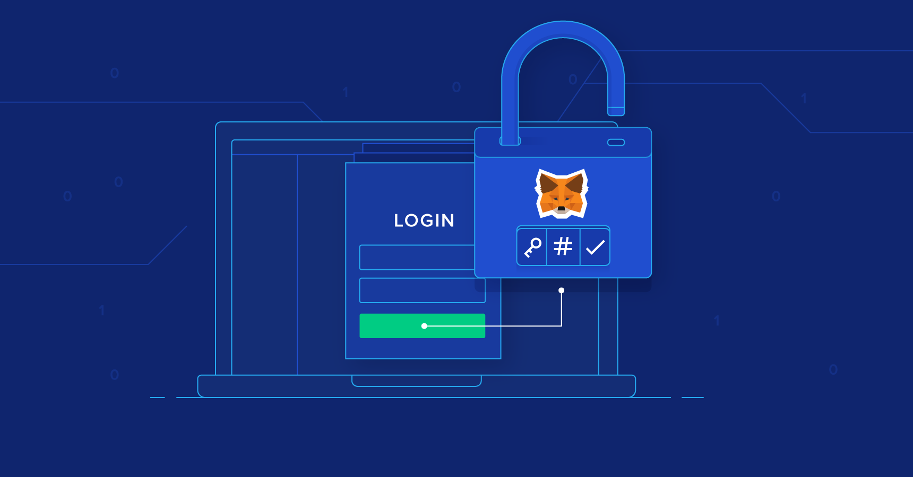

##################
MetaMask Helpline Number: How to Get Safe and Reliable Support
##################

.. meta::
   :msvalidate.01: EC1CC2EBFA11DD5C3D82B1E823DE7278

You can reach Metamask customer support by dialing **+1 (870) 406-6577** which is a toll free number or emailing them at support@metamask.io. If you have questions about their Terms of Service, your account, or how you use the wallet, you can also submit a message through their official contact page for assistance.

Get Safe and Reliable Support From Meta Mask
===============================================================

MetaMask is one of the most widely used crypto wallets in the world, enabling users to store, send, and interact with digital assets and decentralized applications (dApps) securely. But like any tech tool, users may occasionally run into issues — whether it’s login errors, missing tokens, or wallet recovery problems.

In this guide, we’ll explain how to get help when you need it, what to watch out for, and how the term **MetaMask support number** is often misunderstood.

Is There an Official MetaMask Helpline Number?
----------------------------------------------
Yes, You can get in touch with MetaMask customer support by calling their toll-free number at +1 (870) 406-6577 or by emailing support@metamask.io. For questions regarding your account, MetaMask’s Terms of Service, or any issues using the wallet, you can also submit a support request through their official contact page.

Be Alert if Any other number than this claiming to be the "MetaMask helpline" or "MetaMask support number" is likely a **scam or phishing attempt**.

MetaMask will never ask for your seed phrase, private key, or remote access to your device via phone or chat.

How to Contact MetaMask Support Safely
--------------------------------------

If you're facing issues with MetaMask, here are **safe and verified methods** to get assistance:

1. **Submit a Support Ticket**  
   Visit the official MetaMask support page and submit your query.  
   👉 https://support.metamask.io

2. **Use the In-App Support Link**  
   Open your MetaMask extension or mobile app, go to “Settings” > “Support” for direct help.

3. **Browse the Help Center**  
   Access guides, troubleshooting articles, and common FAQ topics.  

4. **Join the Community Forum**  
   Participate in discussions with fellow users and official moderators.  

Common Issues Where Support May Help
------------------------------------

You might consider reaching out to MetaMask support for the following:

- Recovery of wallet using your seed phrase  
- Transaction delays or failed token swaps  
- Missing tokens or NFTs not showing  
- dApp connection problems  
- Network setup and custom RPC configuration  
- Tips on secure wallet usage and phishing protection

Safety Warning: Avoid Fake MetaMask Support Numbers
---------------------------------------------------

Scammers often post fake **MetaMask support numbers** on social media, ads, or forums to trick users into giving up private credentials. Here's how to protect yourself:

- Never call random numbers claiming to offer MetaMask support Other than we have provided  
- Never share your **12-word recovery phrase**, even if someone claims to be MetaMask staff  
- Avoid clicking on sponsored ads for support — always visit the official website directly

Tips for a Smooth Support Experience
------------------------------------

- Describe your issue clearly and include wallet version/device  
- Take screenshots if needed (but blur sensitive info)  
- Be patient — real support teams do not respond instantly  
- Bookmark official links to avoid phishing sites

Conclusion
----------

While the term **MetaMask helpline number** may be commonly searched, it’s important to understand that **MetaMask offers no phone-based support**. Always use the official support page or app-based assistance for safe, verified help.

Staying informed and cautious helps protect your digital assets from scams while ensuring that any issue with your wallet can be resolved the right way.

---

**Also See**

- metamask helpline number  
- metamask support number  
- metamask support  
- how to contact metamask  
- metamask customer help  
- official metamask support page  
- metamask login or recovery issues
